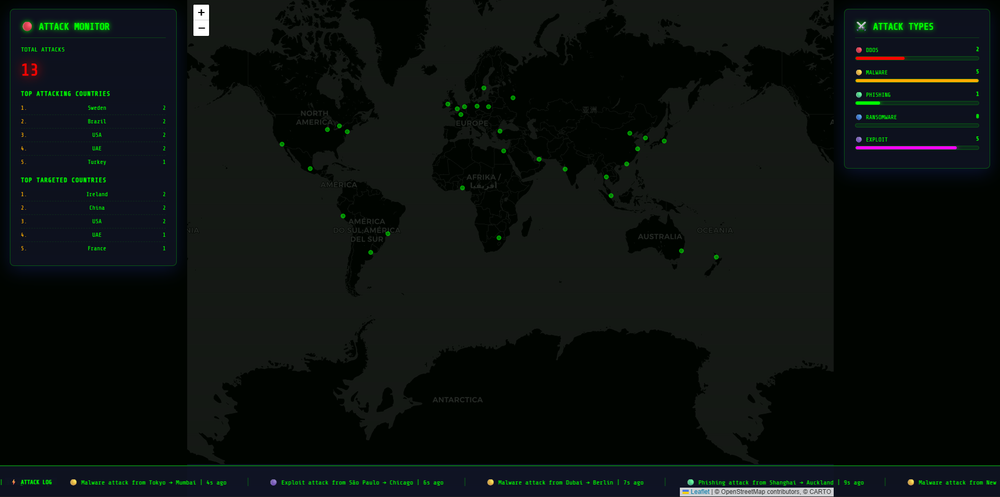

# 🌐 Live Cyber Attack Map

A real-time cyber attack visualization map showing simulated global attacks as animated arcs across a dark world map. Looks straight out of a Hollywood hacker movie. 💀

## 🚀 Live Demo

👉 [View it here](https://minajuddin0510.github.io/live-cyber-attack-tracker)

## 📸 Preview



## ✨ Features

- 🌐 Full screen dark interactive world map
- 🚀 Animated attack arcs flying between cities every 1.5 seconds
- 💥 Pulse explosion animation on impact at target city
- 🎨 Color coded attack types:
  - 🔴 DDoS
  - 🟡 Malware
  - 🟢 Phishing
  - 🔵 Ransomware
  - 🟣 Exploit
- 📊 Live attack counter updating in real time
- 🏆 Top attacking & targeted countries ranked live
- 📜 Scrolling bottom ticker with attack logs
- 📈 Attack type breakdown with animated live count bars
- 🖥️ Scanline overlay for that cinematic hacker monitor look
- ⚠️ Simulated Data badge — fully transparent and honest
- 📱 Fully responsive — looks great on mobile too

## ⚠️ Disclaimer

All attack data shown is **randomly simulated for visual purposes only**. This is not real threat intelligence data. Built purely as a creative coding project.

## 🛠️ Built With

- HTML5
- CSS3 (glassmorphism, scanline effect, neon glow, animations)
- Vanilla JavaScript
- [Leaflet.js](https://leafletjs.com) — interactive maps
- [Share Tech Mono Font](https://fonts.google.com/specimen/Share+Tech+Mono) — Google Fonts

## 🔑 API Key

None needed! All attack data is simulated in JavaScript. No signup, no credit card, nothing. ✅

## 🚀 Getting Started

### Option 1 — Open locally
```bash
git clone https://github.com/minajuddin0510/live-cyber-attack-tracker.git
cd live-cyber-attack-tracker
open index.html
```

### Option 2 — Live on GitHub Pages
1. Push `index.html` to your GitHub repo
2. Go to **Settings → Pages**
3. Set source to `main` branch, root folder
4. Live at `https://minajuddin0510.github.io/live-cyber-attack-tracker` 🎉

## 📁 Project Structure

```
live-cyber-attack-tracker/
├── index.html    # Everything in one file — HTML, CSS, and JS
└── README.md
```

## 📄 License

This project is open source and available under the [MIT License](LICENSE).

---

Made with 💀 by **Minaj Uddin**